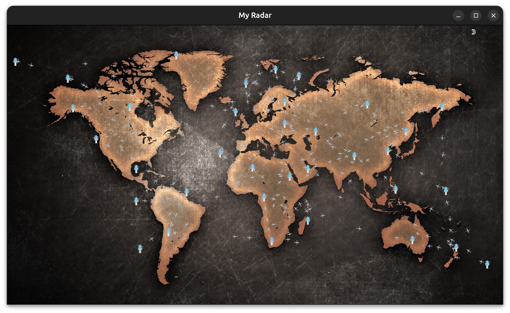
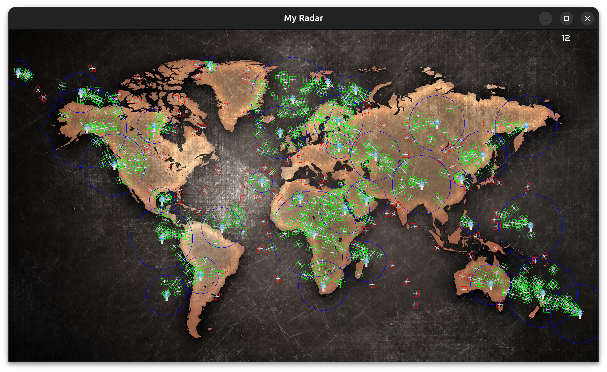

<h1 align="center">
  Radar - 2024<br>
</h1>

<p align="center">
  Radar is a plane simulator in C using CSFML API<br>
</p>




---

## Prerequisite

Install make:
```bash
apt install make
```

Install gcc:
```bash
apt install gcc
```

Install CSFML:
```bash
apt install libcsfml-graphics2.6 libcsfml-system2.6 libcsfml-window2.6 libcsfml-audio2.6
```

---

## Usage

Build binary:
```bash
make
```

Run radar !
```bash
./my_radar -h
```

```bash
./my_radar tests/
```

Example of simulation with 5000 planes and 35 towers.
```bash
./my_radar tests/5000_planes_35_towers.rdr
```

---

Epitech students, beware of -42 !
